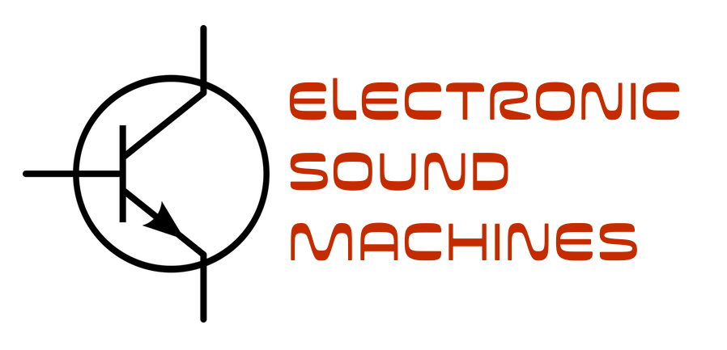

---
# You don't need to edit this file, it's empty on purpose.
# Edit theme's home layout instead if you wanna make some changes
# See: https://jekyllrb.com/docs/themes/#overriding-theme-defaults
layout: home
---

## Welcome to Electronic Sound Machines

The idea is to build stuff that makes sound, learn electronics, be creative, and have fun. We will kick off with building a guitar pedal, and see where we will go after that.

### [Build your own guitar pedal](guitarpedal)

The first series of workshops is about building a guitar pedal, talk about what makes a fuzz fuzz, and things like that. Expect to spend two or three workshops on this (every other week). 
Read more [on this page](guitarpedal), where you will find information about the event, where to get kits, and how to sign up. 

Note that the last date for ordering guitar pedal kits through me is March 18.
